## This is the group project for NUS EE4032

:warning:__Warning: You can access our project at the links given below.__
### :sparkles:Sepolia: You can access our project by clicking [here (official website)](http://www.letusdonate.xyz) or [here (temporary website)](http://47.243.53.79)
### :fire:Ethereum: You can access our project by clicking [here] (in progress) (Once we have raised enough ETH, we will launch our website on the Ethereum mainnet)


## The project file structure is as follows
* /.idea: *This is IntellIJ's configuration folder for the project, and is generally ignored.*
* /contracts: Back-end folders (i.e. smart contracts).
    * /artifacts: *Automatically generated after compilation, do not ignore.*
    * /cache: *Automatically generated after compilation, do not ignore.*
    * /contracts: Store the.SOL file of the project.
    * /script: The ts file is used to deploy the contract to a specific blockchain environment, such as ganache or sepolia.
    * /typechain-types: *Automatically generated after compilation, do not ignore.*
* /front-end: The front-end folder is the directory where the React framework resides.
    * /node_modules: *Store various dependencies for the front end of the project.*
    * /public: The directory of static files when the React framework is initialized.
    * /src: Front-end code, the system uses Typescript to write front-end pages.
    * /package.json: Dependency configuration for front-end projects.
* /node_modules: *Store the dependencies of the root directory of the project, generated by the package.json of the root directory.*


## Deploy to your PC
1. First download the project source code.
2. It is recommended to use **IntelliJ 2023.2.4** or later to open the project. The file structure of the project is shown in the figure. 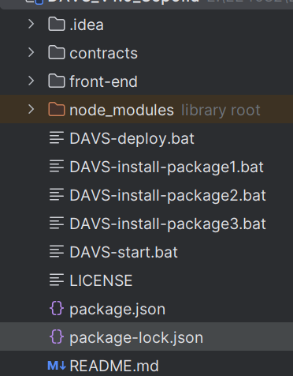
3. Run **DAVS-install-package1.bat**, **DAVS-install-package2.bat**, **DAVS-install-package3.bat** in sequence. These three files are used to automatically download the project dependencies.
4. Configure the **Ganache** or **Sepolia**
    1. If deploying to **Ganache**, download [Ganache](https://archive.trufflesuite.com/ganache/) to your PC first.
        1. Open Ganache and click the "NEW WORKSPACE" button, as shown in the picture. 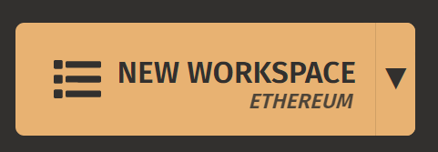
        2. Name your WORKSPACE by any name, as shown in the figure. 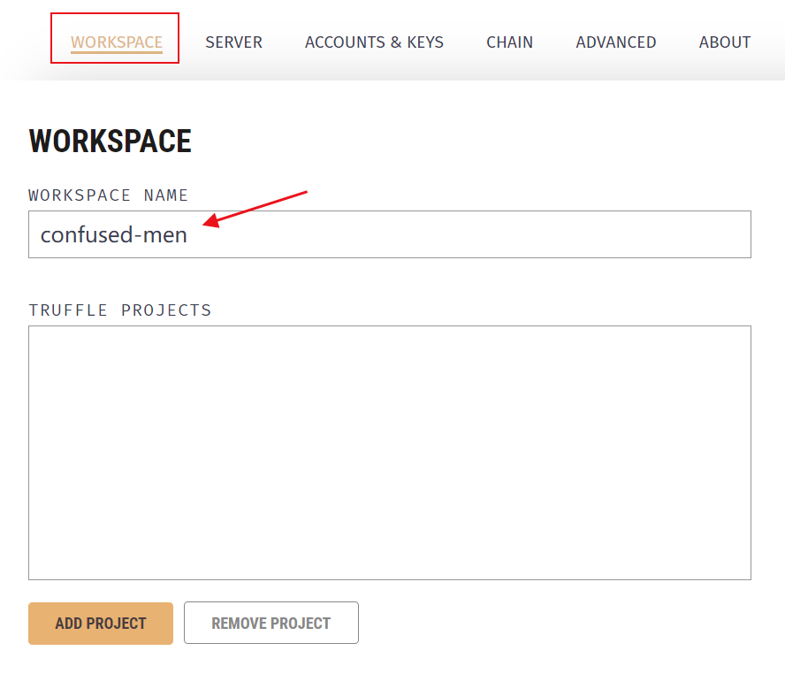
        3. Configuration in SERVER, as shown in Figure. 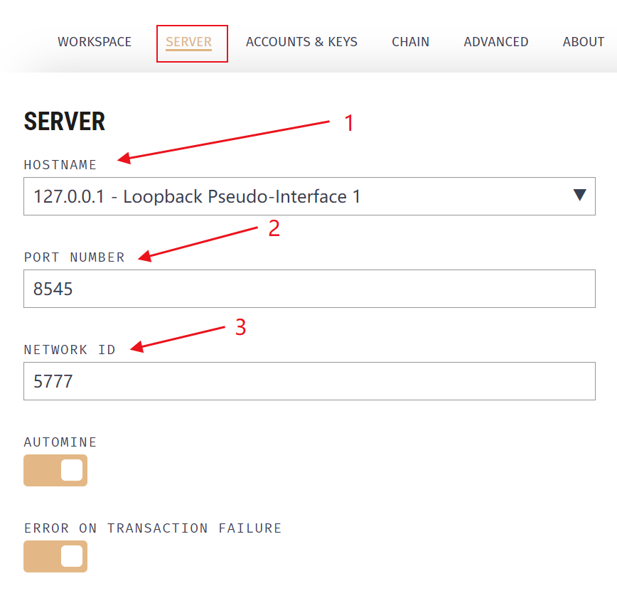
        4. Click the "START" button in the upper right corner to start the Ganache blockchain, and the interface after startup is shown in the figure. 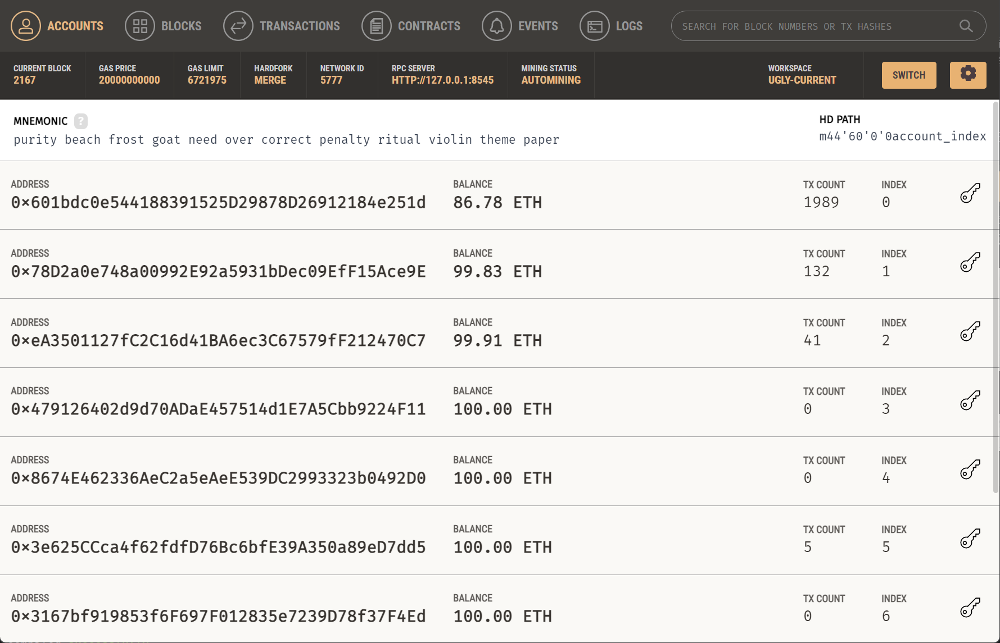
        5. Open the project in the contracts/hardhat.config.ts file, will be in the picture above the RPC SERVER to fill out the url in the following code.
            ```typescript jsx
                 ganache: {
                     url:'http://127.0.0.1:8545' // 本地网络——ganache区块链端口
                 }
            ```
    2. If deploying to **Sepolia**, make sure you already have at least one Sepolia Test Network account address and a small amount of ETH.
        1. Open the project in the contracts/hardhat.config.ts file, will your RPC URL, chainId respectively wrote below the address and the purse to the private key code in the URL, chainId, and in the account.
            ```typescript jsx
                 sepolia: {
                       url:'https://sepolia.infura.io/v3/802ff1f6ca554c3ea370f0acebae425d', // 公共网络——Sepolia区块链端口
                       chainId: 11155111,
                       accounts: ['',] // 钱包的私钥地址 / Input your private key here if you need to deploy to the Sepolia test network
                    }
            ```
5. If you are **not modifying** any of the back-end (Solidity) code, skip this step. Otherwise, if you want to **modify** the back-end (Solidity) code, compile the modified code in Remix, and copy the three contracts (*DonationAndVotingSystemContract.sol*, *GoldContract.sol*, *AwardContract.sol*. **Note that StringHelper does not need to compile!!**) ABI (as shown). 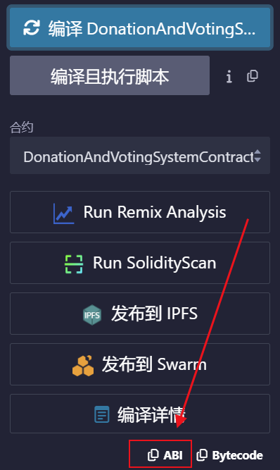
    1. Open front-end/src/utils/abis in the project and you should see 3 files as shown in the figure. 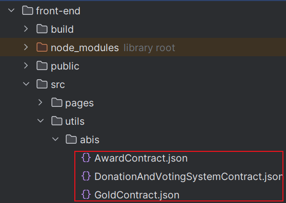
    2. Replace the ABI values in each of the three json files with the abi values you just copied, as shown in the figure. 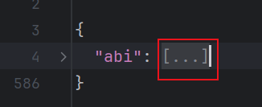
6. In the IntelliJ interface, click the button at the top, as shown in the picture. 
7. Add the configuration of the deployment contract.
    1. If you are using **Ganache**, configuring it as shown in the figure. 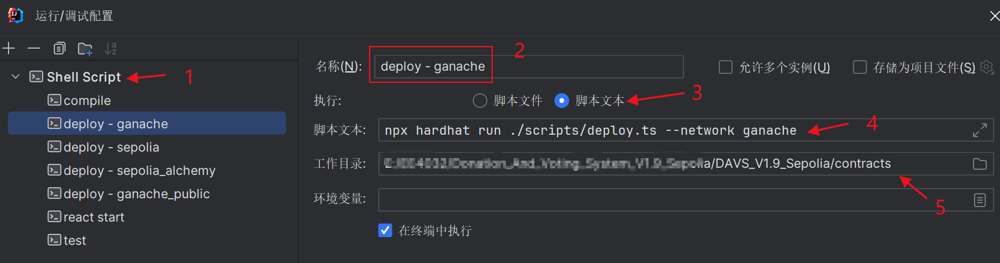
    2. If you are using **Sepolia**, following the instructions in the figure to configure it. 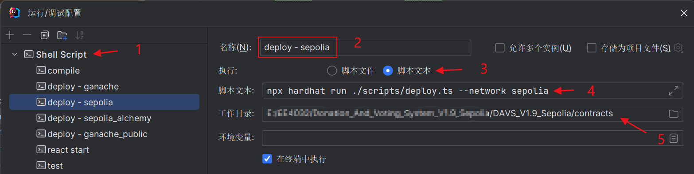
8. Add the configuration to run the front-end program, as shown in the figure. 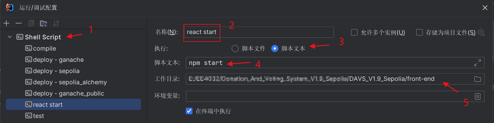
9. Deploy contracts to a blockchain network.
    1. If you are using **Ganache**, run the deploy-ganache you just configured.
        1. A terminal will run and you will see the addresses of the three contracts, copy them, as shown in the figure. 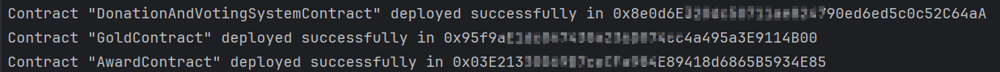
        2. Open the front-end/src/utils/contract-addresses.json file in the project and fill in the addresses you just copied into the following code.
            ``` json
             {
                 "DonationAndVotingSystemContract": "0x123456789",
                 "GoldContract": "0x987654321",
                 "AwardContract": "0x123454321"
             }
            ```
   2. If you are using **Sepolia**, run the deploy-sepolia you just configured.
      1. A terminal will run and you will see the addresses of the three contracts, copy them, as shown in the figure. 
      2. Open the front-end/src/utils/contract-addresses.json file in the project and fill in the addresses you just copied into the following code.
        ``` json
         {
             "DonationAndVotingSystemContract": "0x123456789",
             "GoldContract": "0x987654321",
             "AwardContract": "0x123454321"
         }
        ```
10. Run react start just configured, wait for a period of time, you can use this project! __Remember to configure the network (Ganache / Sepolia) you want to connect in MetaMask wallet.__ 


