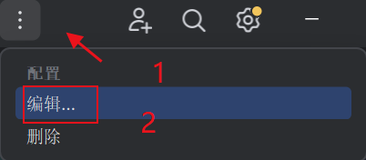

## This is the group project for EE4032

## Sepolia: You can access to this project by clicking [here](http://39.106.52.235:3000)
## Ethereum: You can access to this project by clicking [here] (in progress)


## 项目文件结构如下
* /.idea文件夹：这是IntellIJ针对项目的的配置文件夹，一般不必理会
* /contracts文件夹：后端文件夹（即智能合约）
  * /artifacts文件夹：编译后自动生成，不必理会
  * /cache文件夹：编译后自动生成，不必理会
  * /contracts文件夹：存放本项目的.sol文件
  * /script文件夹：里面的ts文件用来部署合约到指定区块链环境，例如ganache或sepolia等
  * /typechain-types文件夹：编译后自动生成，不必理会
* /front-end文件夹：前端文件夹，即React框架所在目录
  * /node_modules文件夹：存放项目的前端部分的各种依赖，由front-end目录下的package.json生成，git时不必考虑它，可以删除也可以通过npm i命令重新下载依赖
  * /public文件夹：React框架初始化时的静态文件目录
  * /src文件夹：前端代码，本系统使用Typescript编写前端页面（极其类似于Javascript）
  * /package.json文件：前端项目的依赖配置，需要用什么库或组件就在这里声明并指定版本号，然后npm i即可
* /node_modules文件夹：存放项目根目录的依赖，由根目录的package.json生成


## 部署至你的PC
1. 首先下载项目源代码
2. 推荐使用 IntelliJ 2023.2.4 及以上版本打开项目，项目的文件结构如图所示
3. 依次运行DAVS-install-package1.bat, DAVS-install-package2.bat,DAVS-install-package3.bat 这三个文件是用来自动下载项目所需依赖的
4. 配置Ganache / Sepolia
   1. 如果部署到Ganache，请首先下载[Ganache](https://archive.trufflesuite.com/ganache/)软件至你的PC上
      1. 打开Ganache，点击“NEW WORKSPACE”按钮，如图所示
      2. WORKSPACE的名称随便起一个，如图所示
      3. SERVER中的配置，如图所示
      4. 点击右上角的“START”按钮，启动Ganache区块链，启动后的界面如图所示
      5. 打开项目中的contracts/hardhat.config.ts文件，将上图中的RPC SERVER填写到如下代码中的url处
          ```typescript jsx
               ganache: {
                   url:'http://127.0.0.1:8545' // 本地网络——ganache区块链端口
               }
          ```
   2. 如果部署到Sepolia，确保你已拥有至少一个Sepolia Test Network的账户地址并拥有少量的ETH
      1. 打开项目中的contracts/hardhat.config.ts文件，将你的RPC URL, chainId和钱包的私钥地址分别写到如下代码中的url, chainId和account中
          ```typescript jsx
               sepolia: {
                     url:'https://sepolia.infura.io/v3/802ff1f6ca554c3ea370f0acebae425d', // 公共网络——Sepolia区块链端口
                     chainId: 11155111,
                     accounts: ['',] // 钱包的私钥地址 / Input your private key here if you need to deploy to the Sepolia test network
                  }
          ```
5. 如果你不修改任何后端（Solidity）的代码，请跳过此步骤。否则，如果你要修改后端（Solidity）的代码，请在Remix中将修改完成的代码进行编译，并复制三个合约（DonationAndVotingSystemContract.sol, GoldContract.sol, AwardContract.sol. 注意不需要编译StringHelper!!!）的ABI（如图所示）
   1. 打开项目中的front-end/src/utils/abis，此时你会看到3个文件，如图所示
   2. 将刚刚复制的ABI，分别替换三个json文件中的abi的值，如图所示
6. 在IntelliJ的界面，点击上方的按钮，如图所示
7. 添加部署合约的配置
   1. 如果你使用的是Ganache，请按照图中指引进行配置
   2. 如果你使用的是Sepolia，请按照图中指引进行配置
8. 添加运行前端程序的配置，如图所示
9. 将合约部署到区块链网络
   1. 如果你使用的是Ganache，请运行刚才配置好的deploy - ganache
      1. 此时会运行一个终端，你会看到三个合约的地址，复制它们，如图所示
      2. 打开项目中的front-end/src/utils/contract-addresses.json文件，将刚才复制的地址分别填写到如下代码中
          ``` json
           {
               "DonationAndVotingSystemContract": "0x123456789",
               "GoldContract": "0x987654321",
               "AwardContract": "0x123454321"
           }
          ```
   2. 如果你使用的是Sepolia，请运行刚才配置好的deploy - sepolia
      1. 此时会运行一个终端，你会看到三个合约的地址，复制它们，如图所示
      2. 打开项目中的front-end/src/utils/contract-addresses.json文件，将刚才复制的地址分别填写到如下代码中
          ``` json
           {
               "DonationAndVotingSystemContract": "0x123456789",
               "GoldContract": "0x987654321",
               "AwardContract": "0x123454321"
           }
          ```
10. 运行刚才配置好的react start，等待一段时间后，就可以使用本项目了！         


## 更新日志
### 2024.10.01 17:00 Guo Shaojie 更新说明：根据demo项目重构了智能合约.sol文件，前端重构完成度约为70%
### 2024.10.03 18:25 Guo Shaojie 更新说明：前端重构完成度约为95%， 已知BUG为：启动react后，左侧导航栏切换时页面会变白
### 2024.10.10 18:50 Guo Shaojie 更新说明：之前的BUG已修复，已知新的BUG如下：
* 点击“发起捐赠”按钮，输入捐赠内容和起止时间，点击“提交捐赠”按钮后，浏览器控制台会报错，据推断存在问题的代码段为DonationAndVotingSystemContract.tsx文件中的约965行，即
```typescript jsx
<Col span={6}><FileDoneOutlined /> <br/>提案通过率{donationsInfo.length==0?0:(donationsInfo.filter((item)=>item.status===2).length+donationsInfo.filter((item)=>item.status===1).length)==0?0:(donationsInfo.filter((item)=>item.status===2).length / (donationsInfo.filter((item)=>item.status===2).length+donationsInfo.filter((item)=>item.status===1).length) * 100).toFixed(2)}%</Col>
```
* 猜测是变量donationsInfo的问题，因为正常情况下在用户创建新的捐赠后，后端应该返回包含捐赠内容的列表，即具有内容的donationsInfo，但是本项目中donationsInfo变量为undefined。
* 已多次检查后端（即.sol）文件的代码内容，暂未发现错误，所以此BUG应该是前端的问题。
## 2024.10.14 15:20 Guo Shaojie 更新说明：项目所有主要BUG已修复，次要BUG（纪念品相关）的触发机制如下：
* 系统的正常逻辑为：用户每通过3个donation，均有资格获取一次纪念品奖励reward
  * 如果用户依次通过donation并依次领取（不囤积奖励，也就是用户每通过3个donation就立刻领取纪念品奖励）的情况下，不会触发此BUG
  * 如果用户选择囤积奖励，比如通过3个donation后没有立刻领取纪念品奖励，而是选择继续通过donation并累计达到6次后，此时用户首次点击“领取纪念品奖励”按钮后会报JSON错误，且没有任何奖励发送到用户的账户；当用户第二次点击该按钮后，奖励会发送到用户账户，但此时奖励变为了3个而不是2个（正常情况下每3个approval的donation会得到一个纪念品，6个approval的donation应该是2个纪念品），且按钮“领取纪念品奖励”没有隐藏，如果用户继续点击它，系统虽然会提示领取成功，但实际没有任何纪念品到账

该BUG不影响系统的主要功能，如果开发时间紧张，可以在Pre的时候刻意忽略它。
### 2024.10.17 17:00 Guo Shaojie 更新说明：上述的次要BUG已修复大半，如果每3个通过的donation就立即领取纪念品，则不会有BUG出现；若囤积，则第一次点击“领取纪念品奖励”会报JSON错误，再次点击则可以正常领取纪念品奖励。Pre时尽量避免囤积
### 2024.10.17 17:05 Guo Shaojie 更新说明：发现若干新的BUG，如下：
* 投票相关BUG1：用户A创建一个donation，A给自己的donation投票，如果投票次数（approve）大于一次，则只显示一次不显示实际次数，但扣除的gold仍为实际次数
  * 该donation通过后，用户A得到的gold应该是创建donation的费用+实际投票次数的费用，例如创建donation花费1000gold，投了3票approve花费100x3=300gold，则用户A应该得到1000+300=1300gold，但用户A实际得到的gold为1000+100=1100gold，额外的200gold暂不清楚去了哪里。（个人认为原系统的赞同数/反对数是按照人数计算而不是票数计算）
* 投票相关BUG2：与BUG1类似，用户A创建一个donation，但是A不给自己投票，而是由用户B进行投票且投3次approve，用户A得到的实际gold仍为1000+100=1100gold而不是1000+300=1300gold（个人认为原因类似）
* 若系统的donation数据量越多，每次投票、创建操作后或刷新操作后加载时间会变长，性能显著下降
### 2024.10.19 20:00 Guo Shaojie 更新说明：修复原系统ETH => gold不消耗实际的ETH只消耗gas的缺陷，并添加gold => ETH的功能，现在可以自由兑换gold <=> ETH，不算消耗的gas，已经实现原比例兑换，即0.01ETH <=> 10000gold，后续如若盈利可以设置一个反向兑换比例
### 2024.10.20 14:40 Guo Shaojie 更新说明：修复10.17发现的与投票相关的BUG，目前实际投票次数显示正常，且用户会收到donation通过后的实际gold金额
### 2024.10.21 18:00 Guo Shaojie 更新说明：
* 完善投票的相关功能，现在已确保用户在选择approve后，只能继续approve；或选择reject后，无法再approve。仅剩的需求为：设置每个donation只可以reject一次
* 为部分按钮添加“加载中”状态，
* 修改部分前端组件的样式、布局和颜色
### 2024.10.24 12:40 Guo Shaojie 更新说明：已替CJY完成reject only once in per donation（后端部分），该功能已满足项目需求，也可以继续优化
### 2024.10.24 19:50 Guo Shaojie 更新说明：添加Ranking List的功能模块，已知BUG为：排行榜的更新依赖于与区块链的交互操作，也就是必须进行和区块链交互的操作才能更新排行榜，否则刷新页面不会更新(现已通过排行榜的手动刷新按钮修复)
### 2024.10.24 20:40 Guo Shaojie 更新说明：修复最大投票次数的BUG
### 2024.10.27 03:00 Guo Shaojie 更新说明：已实现用户对每个donation的每次approval vote的价格逐次递增，函数为 price = 100 * 2 ^ (n - 1) 其中n为投票次数
### 2024.10.27 23:20 Guo Shaojie 更新说明：已将用户界面和代码注释全部更改为英语，并完善404页面和欢迎页面

## 待完成功能(core)
* 限制每位用户对每个donation的rejected vote数量为1次 ★★★★ CJY (已由GSJ完成)
* 设置一个合适的函数，使得用户对每个donation的每次approval vote的价格逐次递增 ★★★★★ LJY (已由GSJ完成)
* 添加gold => ETH的功能 ★★★★★ LJY / GSJ （已由GSJ完成）
* 平台的抽成（后续如果部署在以太坊主网，可以用来盈利） ★★ GSJ
* 更改前端各个组件的样式、布局、颜色等 ★★★ GSJ （已由GSJ完成）

## 可优化功能(optional)
* 若使用未安装metamask的浏览器访问项目，页面会空白，因为代码没有检测到metamask会报错，应该添加一些类似404的页面 (已由GSJ完成，使用未安装Metamask的浏览器访问项目即可查看)
* 增加ranking list页面，显示目前所有donation的排名 (已由GSJ完成)
* 增加一个好看的首页，美化项目（已由GSJ完成）
* 部署到以太坊主网后，为项目购买域名 （需要少量成本，大约在10SGD/year）
